# Lepron GPT - AI Chat Application with Authentication

A full-stack chat application built with React and Node.js that allows users to have conversations with an AI assistant powered by OpenAI's GPT model.

🔗 **[Live Demo](https://lepron-gpt-with-auth-frontend.onrender.com/)**

## System Architecture

## System Architecture

### Overview
Lepron GPT is a sophisticated full-stack AI chat application implementing a microservices-oriented architecture with session-based authentication, real-time chat capabilities, and persistent data storage. The system follows modern web development patterns with clear separation of concerns across presentation, business logic, and data layers.

### 🏗️ High-Level System Architecture

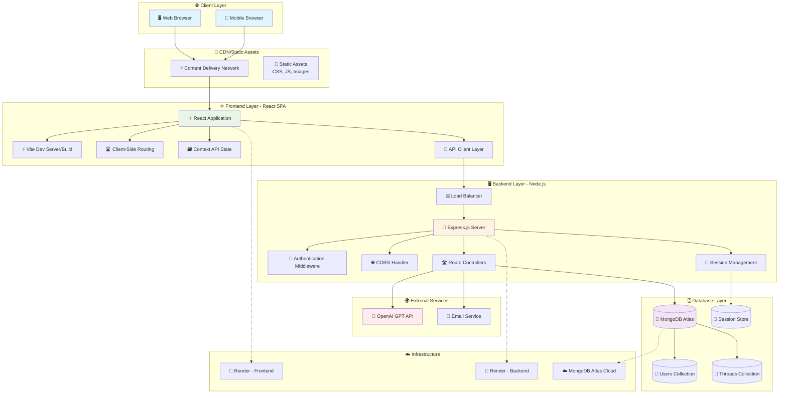

### 🎨 Detailed Frontend Architecture

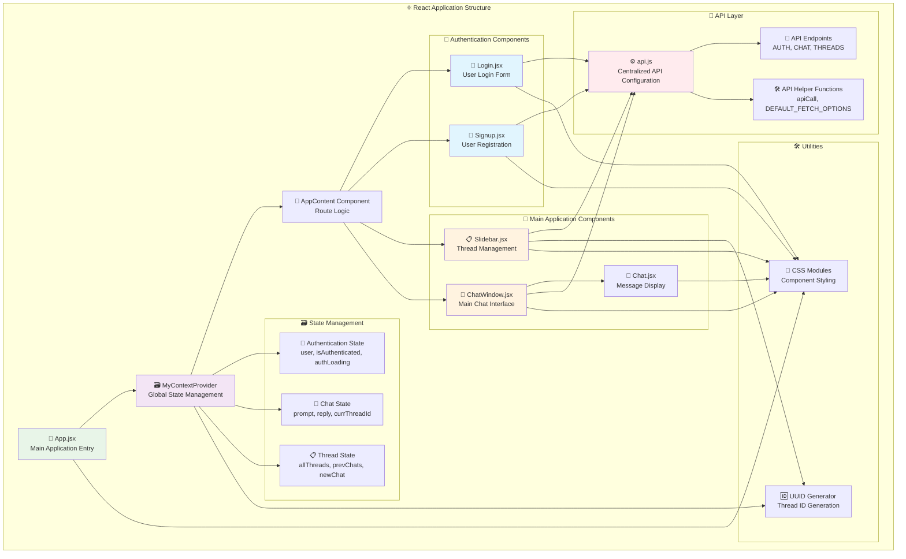

### 🖥️ Backend Architecture Deep Dive

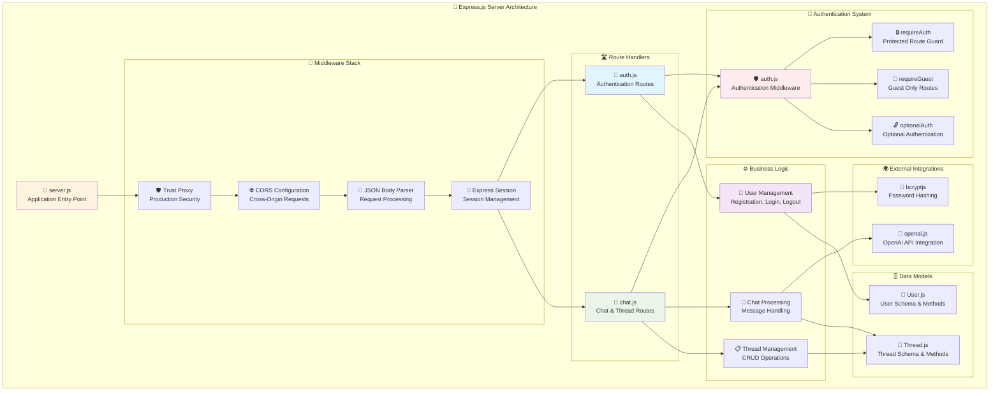

### 🗄️ Database Schema and Relationships

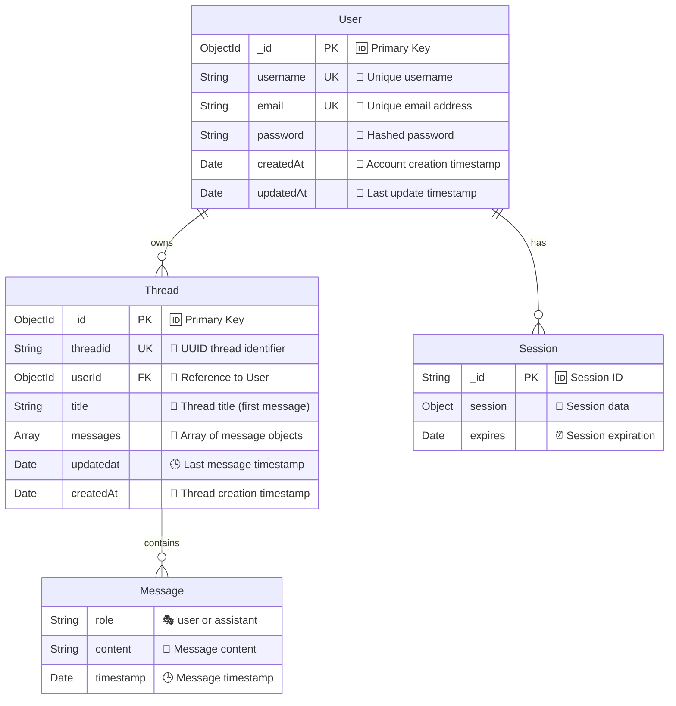

### 🔐 Authentication Flow Architecture

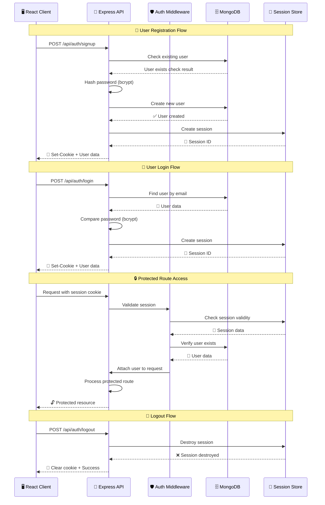

### 💬 Chat Message Flow Architecture

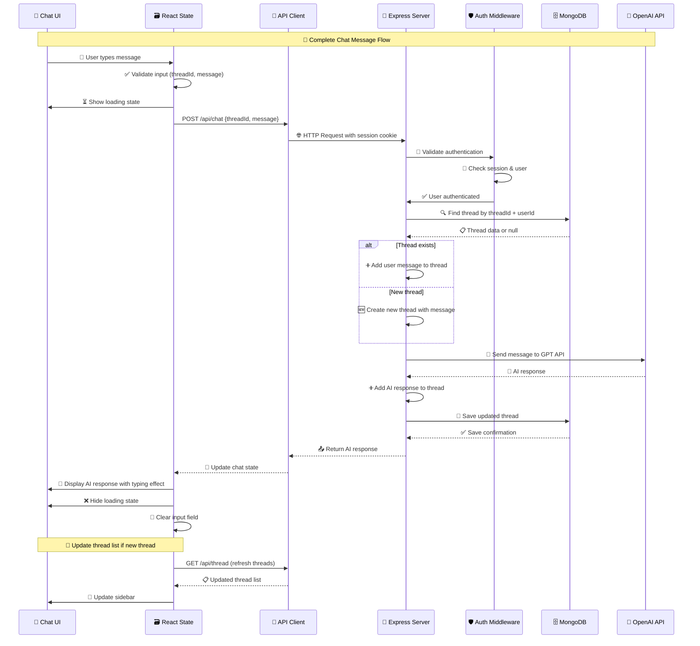

### 📋 Thread Management Architecture

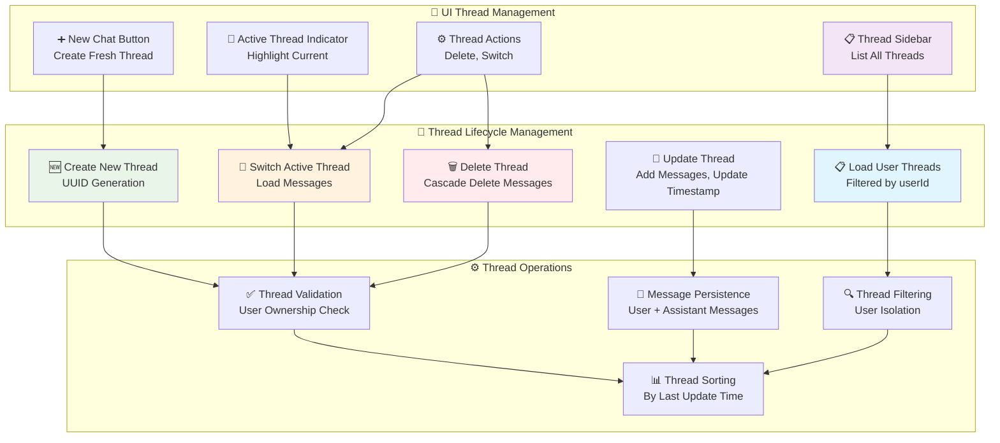

### 🛡️ Security Architecture

```mermaid
graph TB
    subgraph "🔐 Authentication Security"
        PasswordSecurity[🔒 Password Security<br/>bcrypt Hashing + Salt]
        SessionSecurity[🎫 Session Security<br/>HTTP-Only Cookies]
        CSRFProtection[🛡️ CSRF Protection<br/>SameSite Cookies]
        SessionExpiry[⏰ Session Expiry<br/>Configurable TTL]
    end
    
    subgraph "🔒 Authorization Security"
        RouteProtection[🛡️ Route Protection<br/>Authentication Middleware]
        UserIsolation[👤 Data Isolation<br/>User-Scoped Queries]
        OwnershipValidation[✅ Ownership Validation<br/>Resource Access Control]
    end
    
    subgraph "🗄️ Data Security"
        InputValidation[✅ Input Validation<br/>Required Fields Check]
        DataSanitization[🧹 Data Sanitization<br/>XSS Prevention]
        ErrorHandling[🚨 Secure Error Handling<br/>No Data Leakage]
        EnvironmentSecurity[🔐 Environment Security<br/>Secret Management]
    end
    
    subgraph "🌐 Network Security"
        CORSConfiguration[🌐 CORS Configuration<br/>Origin Validation]
        HTTPSEnforcement[🔒 HTTPS Enforcement<br/>Secure Transport]
        RateLimiting[⚡ Rate Limiting<br/>API Abuse Prevention]
    end
    
    PasswordSecurity --> SessionSecurity
    SessionSecurity --> CSRFProtection
    CSRFProtection --> SessionExpiry
    
    RouteProtection --> UserIsolation
    UserIsolation --> OwnershipValidation
    
    InputValidation --> DataSanitization
    DataSanitization --> ErrorHandling
    ErrorHandling --> EnvironmentSecurity
    
    CORSConfiguration --> HTTPSEnforcement
    HTTPSEnforcement --> RateLimiting
    
    style PasswordSecurity fill:#ffebee
    style SessionSecurity fill:#e8f5e8
    style RouteProtection fill:#e1f5fe
    style InputValidation fill:#fff3e0
    style CORSConfiguration fill:#f3e5f5
```

### ☁️ Deployment Architecture

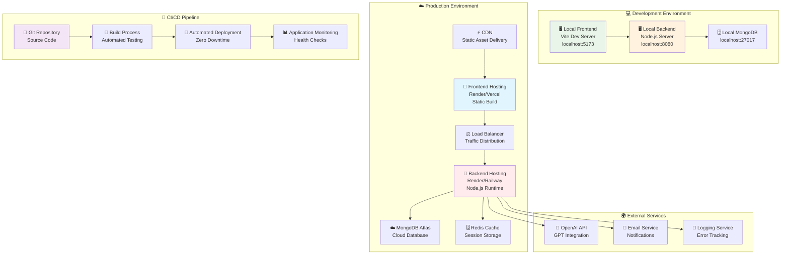

### 🔌 API Architecture and Endpoints

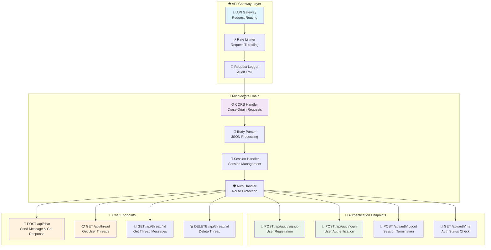

### 🚨 Error Handling and Monitoring Architecture

```mermaid
graph TB
    subgraph "🎨 Frontend Error Handling"
        ErrorBoundary[🛡️ React Error Boundary<br/>Component Error Catching]
        APIErrorHandler[🔌 API Error Handler<br/>Network Error Management]
        UserFeedback[💬 User Feedback<br/>Error Messages & Loading States]
        FallbackUI[🎨 Fallback UI<br/>Graceful Degradation]
    end
    
    subgraph "🖥️ Backend Error Handling"
        GlobalErrorHandler[🌐 Global Error Handler<br/>Centralized Error Processing]
        ValidationErrors[✅ Validation Errors<br/>Input Validation Failures]
        AuthenticationErrors[🔐 Authentication Errors<br/>Auth Failure Handling]
        DatabaseErrors[🗄️ Database Errors<br/>Connection & Query Failures]
    end
    
    subgraph "📊 Monitoring and Logging"
        ApplicationLogs[📝 Application Logs<br/>Request/Response Logging]
        ErrorLogs[🚨 Error Logs<br/>Exception Tracking]
        PerformanceLogs[⚡ Performance Logs<br/>Response Time Monitoring]
        SecurityLogs[🛡️ Security Logs<br/>Auth Attempt Tracking]
    end
    
    subgraph "🔔 Alerting System"
        ErrorAlerts[🚨 Error Rate Alerts<br/>High Error Rate Detection]
        PerformanceAlerts[⚡ Performance Alerts<br/>Slow Response Detection]
        SecurityAlerts[🛡️ Security Alerts<br/>Suspicious Activity Detection]
        UptimeAlerts[📊 Uptime Alerts<br/>Service Availability Monitoring]
    end
    
    ErrorBoundary --> APIErrorHandler
    APIErrorHandler --> UserFeedback
    UserFeedback --> FallbackUI
    
    GlobalErrorHandler --> ValidationErrors
    GlobalErrorHandler --> AuthenticationErrors
    GlobalErrorHandler --> DatabaseErrors
    
    ApplicationLogs --> ErrorLogs
    ErrorLogs --> PerformanceLogs
    PerformanceLogs --> SecurityLogs
    
    ErrorAlerts --> PerformanceAlerts
    PerformanceAlerts --> SecurityAlerts
    SecurityAlerts --> UptimeAlerts
    
    style ErrorBoundary fill:#ffebee
    style GlobalErrorHandler fill:#fff3e0
    style ApplicationLogs fill:#e8f5e8
    style ErrorAlerts fill:#e1f5fe
```

### Frontend Architecture (React + Vite)

#### Component Hierarchy
```
App.jsx
├── MyContextProvider (Global State)
│   ├── AppContent
│   │   ├── Login.jsx (Unauthenticated)
│   │   ├── Signup.jsx (Unauthenticated)
│   │   └── Authenticated Layout
│   │       ├── Slidebar.jsx (Thread Management)
│   │       └── ChatWindow.jsx (Main Chat Interface)
│   │           └── Chat.jsx (Message Display)
```

#### State Management
- **MyContext.jsx**: Centralized state using React Context API
  - Authentication state (`user`, `isAuthenticated`, `authLoading`)
  - Chat state (`prompt`, `reply`, `currThreadId`, `prevChats`)
  - Thread management (`allThreads`, `newChat`)

#### API Configuration
- **config/api.js**: Centralized API endpoint management
  - Environment-based URL switching (local/production)
  - Consistent fetch options with credentials
  - Helper functions for API calls

### Backend Architecture (Node.js + Express)

#### Server Structure
```
server.js (Main Entry Point)
├── CORS Configuration
├── Session Management (MongoDB Store)
├── Route Handlers
│   ├── /api/auth/* (Authentication Routes)
│   └── /api/* (Chat & Thread Routes)
└── Database Connection (Mongoose)
```

#### Middleware Stack
1. **CORS**: Cross-origin resource sharing with credentials
2. **Express Session**: Session-based authentication with MongoDB store
3. **JSON Parser**: Request body parsing
4. **Authentication Middleware**: Route protection

#### Route Architecture
```
routes/
├── auth.js
│   ├── POST /signup (User Registration)
│   ├── POST /login (User Authentication)
│   ├── POST /logout (Session Termination)
│   └── GET /me (Auth Status Check)
└── chat.js
    ├── POST /chat (Send Message & Get AI Response)
    ├── GET /thread (Get User's Threads)
    ├── GET /thread/:id (Get Thread Messages)
    └── DELETE /thread/:id (Delete Thread)
```

### Database Schema (MongoDB)

#### User Model
```javascript
{
  _id: ObjectId,
  username: String (unique, required),
  email: String (unique, required),
  password: String (hashed with bcrypt),
  createdAt: Date,
  updatedAt: Date
}
```

#### Thread Model
```javascript
{
  _id: ObjectId,
  threadid: String (UUID, unique),
  userId: ObjectId (ref: User),
  title: String (first message),
  messages: [{
    role: String ('user' | 'assistant'),
    content: String,
    timestamp: Date
  }],
  updatedat: Date,
  createdAt: Date
}
```

#### Session Store
- MongoDB-based session storage using `connect-mongo`
- Session data includes `userId` and `username`
- Automatic session cleanup and expiration

### Authentication Flow

```
1. User Registration/Login
   ├── Frontend sends credentials
   ├── Backend validates & creates session
   ├── Session stored in MongoDB
   └── Session cookie sent to client

2. Protected Route Access
   ├── Frontend sends request with session cookie
   ├── Backend validates session via middleware
   ├── User data attached to request object
   └── Route handler processes authenticated request

3. Logout
   ├── Frontend calls logout endpoint
   ├── Backend destroys session
   ├── Session removed from MongoDB
   └── Cookie cleared on client
```

### Chat Flow Architecture

```
1. Message Sending
   ├── User types message in ChatWindow
   ├── Frontend validates (thread ID, message content)
   ├── POST request to /api/chat with threadid & message
   └── Loading state activated

2. Backend Processing
   ├── Authentication middleware validates session
   ├── Find or create thread in database
   ├── Add user message to thread
   ├── Call OpenAI API for response
   ├── Add AI response to thread
   ├── Update thread timestamp
   └── Return AI response to frontend

3. Frontend Update
   ├── Receive AI response
   ├── Update chat history in context
   ├── Display message with typing effect
   ├── Clear input and loading state
   └── Refresh thread list if new thread
```

### Environment Configuration

#### Development Environment
```
Backend:
- MONGODB_URI: Local MongoDB instance
- FRONTEND_URL: http://localhost:5173
- NODE_ENV: development
- Session: secure=false, sameSite='lax'

Frontend:
- VITE_API_URL: http://localhost:8080
- VITE_NODE_ENV: development
```

#### Production Environment
```
Backend:
- MONGODB_URI: MongoDB Atlas connection
- FRONTEND_URL: https://lepron-gpt-with-auth-frontend.onrender.com
- NODE_ENV: production
- Session: secure=true, sameSite='none'

Frontend:
- VITE_API_URL: https://lepron-gpt-with-auth.onrender.com
- VITE_NODE_ENV: production
```

### Security Implementation

#### Authentication Security
- **Password Hashing**: bcryptjs with salt rounds
- **Session Management**: Secure HTTP-only cookies
- **CSRF Protection**: SameSite cookie attribute
- **Route Protection**: Authentication middleware on all protected routes

#### Data Security
- **User Isolation**: All threads filtered by userId
- **Input Validation**: Required field validation on all endpoints
- **Error Handling**: Consistent error responses without data leakage
- **Environment Variables**: Sensitive data stored in .env files

### API Integration

#### OpenAI Integration
```javascript
// utils/openai.js
- Model: gpt-4o-mini
- Request format: Chat completions API
- Error handling: Network and API errors
- Response processing: Extract message content
```

### Deployment Architecture

#### Frontend (Render/Vercel)
- Static build deployment
- Environment variables configured
- CORS headers for API communication

#### Backend (Render/Railway)
- Node.js server deployment
- Environment variables for production
- MongoDB Atlas connection
- Session store configuration

#### Database (MongoDB Atlas)
- Cloud-hosted MongoDB cluster
- Connection string with authentication
- Automatic backups and scaling

### Performance Considerations

#### Frontend Optimizations
- React Context for efficient state management
- Conditional rendering for authentication states
- Lazy loading for chat history
- Debounced API calls

#### Backend Optimizations
- MongoDB indexing on frequently queried fields
- Session store with TTL for automatic cleanup
- Efficient thread filtering by user
- Connection pooling for database

### Error Handling Strategy

#### Frontend Error Handling
- Try-catch blocks for all API calls
- User-friendly error messages
- Loading states for better UX
- Fallback UI for failed states

#### Backend Error Handling
- Centralized error handling middleware
- Consistent error response format
- Logging for debugging
- Graceful degradation

This architecture ensures scalability, maintainability, and security while providing a smooth user experience for AI-powered conversations.

## Features

- 🔐 **User Authentication** - Secure signup/login with session-based auth
- 💬 **Real-time chat** with AI assistant
- 📝 **Multiple conversation threads** per user
- ⚡ **Typing effect** for AI responses
- 📱 **Responsive design**
- 🔄 **Thread management** (create, switch, delete)
- 💾 **Persistent chat history** with user isolation
- 🎨 **Modern UI** with Font Awesome icons
- 🛡️ **Secure sessions** stored in MongoDB

## Tech Stack

### Frontend
- **React** - UI framework
- **Vite** - Build tool and dev server
- **React Markdown** - Markdown rendering for AI responses
- **Context API** - State management

### Backend
- **Node.js** - Runtime environment
- **Express.js** - Web framework
- **MongoDB** - Database for data and session storage
- **Mongoose** - MongoDB ODM
- **OpenAI API** - AI chat completions
- **Express-session** - Session-based authentication
- **connect-mongo** - MongoDB session store
- **bcryptjs** - Password hashing

## Prerequisites

- Node.js (v16 or higher)
- MongoDB (local or cloud instance)
- OpenAI API key

## Installation

1. **Clone the repository**
   ```bash
   git clone <repository-url>
   cd ai-chat-app
   ```

2. **Install Backend Dependencies**
   ```bash
   cd Backend
   npm install
   ```

3. **Install Frontend Dependencies**
   ```bash
   cd Frontend
   npm install
   ```

4. **Environment Setup**

   Create a `.env` file in the `Backend` directory:
   ```env
   OPENAI_API_KEY=your_openai_api_key_here
   MONGODB_URI=mongodb://localhost:27017/chatapp
   SESSION_SECRET=your_session_secret_key_here
   PORT=8080
   ```

## Running the Application

1. **Start the Backend Server**
   ```bash
   cd Backend
   npm start
   ```
   Server will run on `http://localhost:8080`

2. **Start the Frontend Development Server**
   ```bash
   cd Frontend
   npm run dev
   ```
   Frontend will run on `http://localhost:5173`

## API Endpoints

### Authentication Routes
- `POST /api/auth/signup` - Create new user account
- `POST /api/auth/login` - User login
- `POST /api/auth/logout` - User logout
- `GET /api/auth/me` - Check authentication status

### Chat Routes (Protected)
- `POST /api/chat` - Send message and get AI response
- `GET /api/thread` - Get user's conversation threads
- `GET /api/thread/:threadid` - Get specific thread messages
- `DELETE /api/thread/:threadid` - Delete a thread

## Project Structure

```
├── Backend/
│   ├── models/
│   │   ├── Thread.js          # Chat thread schema
│   │   └── User.js            # User schema with auth
│   ├── routes/
│   │   ├── auth.js            # Authentication routes
│   │   └── chat.js            # Chat API routes
│   ├── middleware/
│   │   └── auth.js            # Authentication middleware
│   ├── utils/
│   │   └── openai.js          # OpenAI integration
│   └── server.js              # Express server with session config
├── Frontend/
│   ├── src/
│   │   ├── components/
│   │   │   ├── Chat.jsx       # Chat display component
│   │   │   ├── ChatWindow.jsx # Main chat interface
│   │   │   ├── Slidebar.jsx   # Thread sidebar
│   │   │   ├── Login.jsx      # Login component
│   │   │   └── Signup.jsx     # Signup component
│   │   ├── context/
│   │   │   └── MyContext.jsx  # React context with auth
│   │   └── App.jsx            # Main app with routing
│   └── index.html
└── README.md
```

## Usage

1. **Sign up** for a new account or **log in** with existing credentials
2. Once authenticated, you'll see the chat interface
3. **Start a new conversation** by typing a message
4. The AI will respond with a typing effect
5. **Create multiple threads** for different conversations
6. **Switch between threads** using the sidebar
7. **Delete threads** using the minus icon
8. **Log out** when finished


## Acknowledgments

- OpenAI for providing the GPT API
